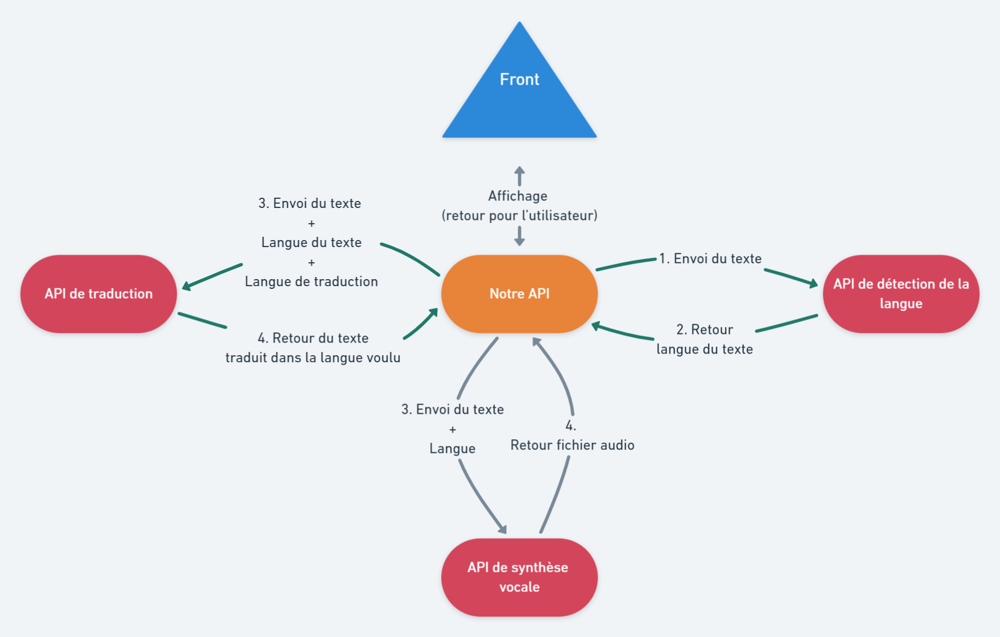

# 
WebService API Traduction

## 
**Cahier des charges technique**

* ## Sommaire

    1. [Besoins Fonctionnels](#Fonctionnels)

    2. [Besoins techniques](#Techniques)

    3. [API Utilisateur](#Utilisateur)

    4. [API Traduction](#Taduction)

    5. [API Synthèse vocale](#Vocale)

    6. [Front](#Front)

 

* ## Besoins Fonctionnels (client)

    Un utilisateur va taper un texte (1000 caractères max) dans une langue de son choix. Provoquer : l'Interrogation d'une api pour connaitre la langue tapée puis une api de traduction qui nous renvoie le texte dans la langue que l'on souhaite et avoir au niveau de l'utilisateur une restitution du langage traduit. 
    Il faut aussi avoir la possibilité de le faire lire par une autre api qui va le convertir en fichier audio

* ## Besoins techniques

    Tous le projet (informations, API, ... ) est présent sur github à cette addresse : https://github.com/DemonBlueFox/WebService

    Nous allons devélopper une API pour communiquer avec l'utilisateur. Nous utiliserons également des API open source pour traduire le texte envoyer par l'utilisateur ou faire la transcription orale du texte (à travers une synthèse vocale).

    

 

* ### API de traduction
    Pour l'API de traduction, nous utiliserons [LibreTranslate](https://github.com/LibreTranslate/LibreTranslate). Cette API permet à la fois de detecter la langue d'un texte mais aussi de traduire ce texte. 17 langues sont disponibles.

    Une requête HTTP POST pour mettre le texte ainsi que la langue dans laquelle on veut traduire et on récupérer le texte traduit.

* ### API de Synthèse Vocale 
    

    Pour l'API de Synthèse Vocale, l'API [Text-To-Speech](https://www.voicerss.org/api/) par Voicerss est une très bonne solution. Elle permet la retranscription d'un texte à partir d'une requête POST ou GET. 49 langues sont disponibles.

    Une requête HTTTP POST 

* ### Front
    

    L'utilisateur aura lui accès à une interface simple. Celle-ci est développé avec vue.js qui permet de faire une application web monopage simple et efficace.